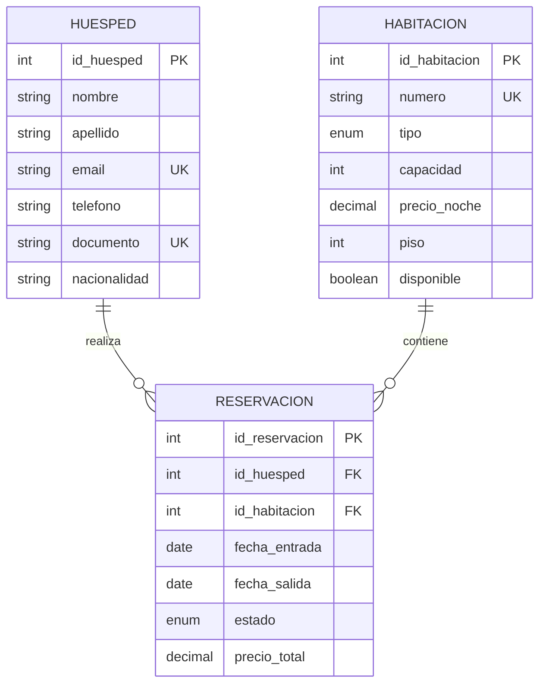

# 🏨 Better Homes Hotel - Room Management System

¡Bienvenido al sistema de gestión de reservaciones de **Better Homes Hotel**! Este proyecto es una solución integral que conecta una aplicación moderna de **React** con una robusta base de datos **MySQL**, diseñada para optimizar la fluidez operativa y financiera del hotel.

---

## 🛠️ Stack Tecnológico

*   **Frontend:** React 18, Vite, Redux Toolkit, Tailwind CSS, Lucide React.
*   **Backend:** Node.js, Express, Sequelize ORM.
*   **Base de Datos:** MySQL 8.0.
*   **Documentación:** Markdown, Mermaid.js.

---

## 📂 Estructura del Proyecto

*   `/hotelfinal`: Aplicación frontend (React + Redux).
*   `/server`: Servidor API REST (Node + Sequelize).
*   `/bdMysql`: Scripts de creación y semillas de la base de datos.
*   `/documentacion_final.html`: Documentación exportable a PDF.

---

# 📊 Documentación de la Base de Datos (`hotel_db`)

## 1. Diagrama Entidad-Relación (ERD)

Representación conceptual de cómo fluyen los datos entre huéspedes, habitaciones y reservaciones.



---

## 2. Requerimientos del Sistema

### 2.1 Requerimientos Funcionales (RF)
*   **RF-01:** Gestión completa de Huéspedes (CRUD).
*   **RF-02:** Control de inventario y disponibilidad de Habitaciones.
*   **RF-03:** Procesamiento de reservaciones con validación de fechas.
*   **RF-04:** Cálculo automático de montos basados en estancia.
*   **RF-05:** Soporte para múltiples categorías (Suite, Penthouse, etc.).

### 2.2 Requerimientos No Funcionales (RNF)
*   **RNF-01:** Integridad referencial mandatoria (Foreign Keys).
*   **RNF-02:** Rendimiento optimizado mediante índices en campos únicos.
*   **RNF-03:** Transacciones ACID garantizadas por el motor InnoDB.
*   **RNF-04:** Escalabilidad para soportar alto volumen de registros.

---

## 3. Implementación SQL e Inteligencia de Datos

### 3.1 Catálogo de 10 Vistas Profesionales
El sistema incluye 10 vistas SQL diseñadas para la **fluidez de la información**:

1.  **Ocupación Actual:** Habitaciones ocupadas hoy y responsables.
2.  **Disponibilidad Real:** Inventario inmediato para nuevas ventas.
3.  **Detalle de Ingresos:** Reporte financiero por reservación.
4.  **Clientes VIP:** Top 10 de huéspedes según su inversión total.
5.  **Próximas Llegadas:** Lista de Check-ins para el día de hoy.
6.  **Próximas Salidas:** Lista de Check-outs para mantenimiento y limpieza.
7.  **Popularidad de Habitaciones:** Análisis de demanda por categoría.
8.  **Auditoría de Cancelaciones:** Registro de pérdidas y motivos.
9.  **Ingresos Mensuales:** Reporte contable periódico (Mes/Año).
10. **Estancias de Larga Duración:** Identificación de clientes para programas de fidelidad.

---

## 🚀 Instalación y Ejecución

### 1. Base de Datos
Importa el archivo localizado en `bdMysql/seed_data.sql` en tu gestor MySQL.

### 2. Servidor (Backend)
```bash
cd server
npm install
npm run dev
```

### 3. Aplicación (Frontend)
```bash
cd hotelfinal
npm install
npm run dev
```

---

## 📄 Exportación a PDF
Para ver la documentación técnica completa lista para entregar, abre el archivo `documentacion_final.html` en tu navegador y utiliza la función **"Exportar a PDF"**.

---
*Desarrollado para el proyecto final de Administración de Bases de Datos.*
