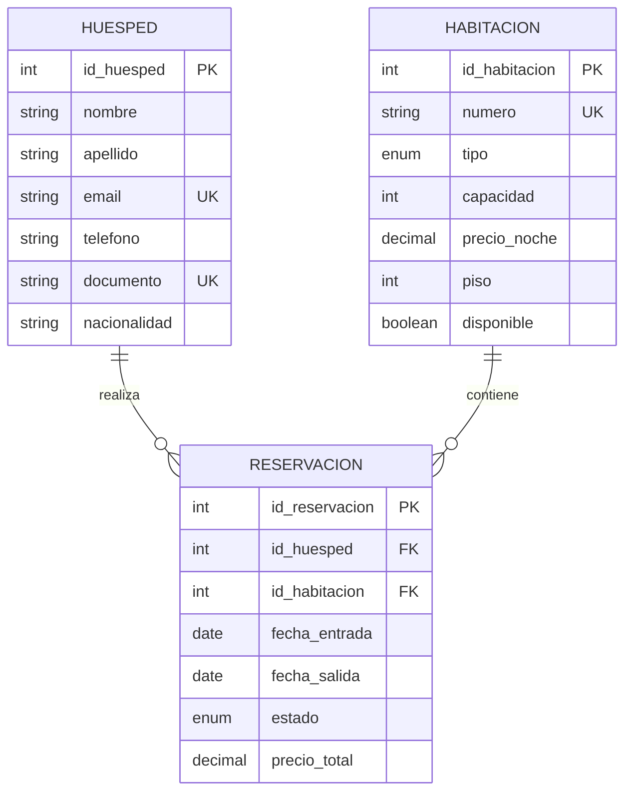

# 🏨 Better Homes Hotel - Sistema de Gestión de Reservaciones


Este proyecto representa una solución integral para la administración hotelera, conectando un frontend moderno en **React** con un ecosistema de datos robusto en **MySQL**. Diseñado bajo principios de **fluidez de información**, integridad relacional e inteligencia de negocio.

---

### 👥 Desarrollado por:
*   **LUIS ALBERTO BUELVAS COGOLLO** - Grupo 56647
*   **CAMILA ANDREA HERRERA GAMBOA** - Grupo 56648

**Curso:** ADMINISTRACION DE BASES DE DATOS  
**Docente:** SERGIO ALEXANDER MORA NOVOA  
**Programa:** Ingeniería de Sistemas  
**Institución:** Corporación Unificada Nacional de Educación Superior - CUN  
**Año:** 2026

---

## 📑 Índice de Contenido
1. [Diagrama Entidad-Relación (ERD)](#1-diagrama-entidad-relación-erd)
2. [Requerimientos del Sistema](#2-requerimientos-del-sistema)
3. [Modelo Relacional (Tablas)](#3-modelo-relacional-tablas)
4. [Código SQL de Creación (DDL)](#4-código-sql-de-creación-ddl)
5. [Catálogo de 10 Vistas SQL (Fluidez de Datos)](#5-catálogo-de-10-vistas-sql-fluidez-de-datos)
6. [Instalación y Configuración](#6-instalación-y-configuración)

---

## 1. Diagrama Entidad-Relación (ERD)

Visualización de las entidades principales y sus interacciones.



---

## 2. Requerimientos del Sistema

### 2.1 Requerimientos Funcionales (RF)
*   **RF-01: Gestión de Huéspedes:** Registro único por correo/documento.
*   **RF-02: Control de Inventario:** Gestión dinámica de disponibilidad de habitaciones.
*   **RF-03: Procesamiento de Reservas:** Vinculación temporal de activos.
*   **RF-04: Cálculo Financiero:** Estimación automática de costos totales.
*   **RF-05: Auditoría:** Trazabilidad de creaciones y actualizaciones.

### 2.2 Requerimientos No Funcionales (RNF)
*   **RNF-01: Integridad Referencial:** Restricciones estrictas de FK.
*   **RNF-02: Rendimiento:** Indexación en campos de búsqueda clave.
*   **RNF-03: Consistencia:** Motor InnoDB para transacciones ACID.
*   **RNF-04: Seguridad:** Credenciales cifradas y accesos restringidos.

---

## 3. Modelo Relacional (Tablas)

| Tabla | Propósito | Campos Clave |
| :--- | :--- | :--- |
| `huespedes` | Perfiles de clientes | `email`, `documento` |
| `habitaciones` | Inventario físico | `numero`, `tipo` |
| `reservaciones` | Historial y facturación | `id_huesped`, `id_habitacion` |

---

## 4. Código SQL de Creación (DDL)

```sql
-- Estructura Principal
CREATE DATABASE hotel_db;
USE hotel_db;

CREATE TABLE huespedes (
    id_huesped INT AUTO_INCREMENT PRIMARY KEY,
    nombre VARCHAR(100) NOT NULL,
    email VARCHAR(150) UNIQUE NOT NULL,
    documento VARCHAR(50) UNIQUE
);

CREATE TABLE habitaciones (
    id_habitacion INT AUTO_INCREMENT PRIMARY KEY,
    numero VARCHAR(10) UNIQUE NOT NULL,
    tipo ENUM('individual', 'doble', 'suite', 'penthouse'),
    precio_noche DECIMAL(10, 2) NOT NULL,
    disponible BOOLEAN DEFAULT TRUE
);

CREATE TABLE reservaciones (
    id_reservacion INT AUTO_INCREMENT PRIMARY KEY,
    id_huesped INT NOT NULL,
    id_habitacion INT NOT NULL,
    fecha_entrada DATE NOT NULL,
    fecha_salida DATE NOT NULL,
    precio_total DECIMAL(10, 2),
    FOREIGN KEY (id_huesped) REFERENCES huespedes(id_huesped),
    FOREIGN KEY (id_habitacion) REFERENCES habitaciones(id_habitacion)
);
```

---

## 5. Análisis y Fluidez de Datos (Vistas SQL)

Estas vistas permiten realizar análisis rápidos y operar el negocio con eficiencia sin lógica adicional en el backend. Puedes ejecutarlas y consultarlas directamente en MySQL Workbench.

### � Indicadores Básicos de Análisis

#### 1. Cantidad de Habitaciones Libres (`view_total_habitaciones_libres`)
Muestra el total de habitaciones que están marcadas como disponibles.
```sql
CREATE OR REPLACE VIEW view_total_habitaciones_libres AS
SELECT COUNT(*) AS total_disponibles
FROM habitaciones
WHERE disponible = TRUE;

-- Consulta en Workbench:
SELECT * FROM view_total_habitaciones_libres;
```

#### 2. Cantidad de Usuarios Registrados (`view_total_huespedes`)
Conteo total de huéspedes en la base de datos.
```sql
CREATE OR REPLACE VIEW view_total_huespedes AS
SELECT COUNT(*) AS total_registrados
FROM huespedes;

-- Consulta en Workbench:
SELECT * FROM view_total_huespedes;
```

#### 3. Reservaciones por Mes (`view_conteo_reservas_mensuales`)
Cantidad de reservaciones realizadas agrupadas por mes y año.
```sql
CREATE OR REPLACE VIEW view_conteo_reservas_mensuales AS
SELECT YEAR(fecha_entrada) AS anio, MONTH(fecha_entrada) AS mes, COUNT(*) AS total_reservas
FROM reservaciones
GROUP BY anio, mes
ORDER BY anio DESC, mes DESC;

-- Consulta en Workbench:
SELECT * FROM view_conteo_reservas_mensuales;
```

#### 4. Usuarios Frecuentes (`view_huespedes_frecuentes`)
Huéspedes con el mayor número de estancias en el hotel.
```sql
CREATE OR REPLACE VIEW view_huespedes_frecuentes AS
SELECT CONCAT(h.nombre, ' ', h.apellido) AS huesped, h.email, COUNT(r.id_reservacion) AS total_estancias
FROM huespedes h
JOIN reservaciones r ON h.id_huesped = h.id_huesped
GROUP BY h.id_huesped
ORDER BY total_estancias DESC;

-- Consulta en Workbench:
SELECT * FROM view_huespedes_frecuentes;
```

#### 5. Habitaciones más Utilizadas (`view_habitaciones_populares`)
Lista de habitaciones con mayor número de reservaciones acumuladas.
```sql
CREATE OR REPLACE VIEW view_habitaciones_populares AS
SELECT hab.numero, hab.tipo, COUNT(r.id_reservacion) AS veces_reservada
FROM habitaciones hab
JOIN reservaciones r ON hab.id_habitacion = r.id_habitacion
GROUP BY hab.id_habitacion
ORDER BY veces_reservada DESC;

-- Consulta en Workbench:
SELECT * FROM view_habitaciones_populares;
```

---

### 📋 Catálogo de 10 Vistas Profesionales (Gestión Operativa)

#### 1. Ocupación Actual (`view_ocupacion_actual`)
¿Qué habitaciones están ocupadas HOY?
```sql
CREATE OR REPLACE VIEW view_ocupacion_actual AS
SELECT hab.numero, hab.tipo, CONCAT(h.nombre, ' ', h.apellido) AS huesped, r.fecha_salida
FROM habitaciones hab
JOIN reservaciones r ON hab.id_habitacion = r.id_habitacion
JOIN huespedes h ON r.id_huesped = h.id_huesped
WHERE CURDATE() BETWEEN r.fecha_entrada AND r.fecha_salida AND r.estado = 'activa';

-- Consulta en Workbench:
SELECT * FROM view_ocupacion_actual;
```

#### 2. Disponibilidad Real (`view_disponibilidad_real`)
Habitaciones listas para ser vendidas.
```sql
CREATE OR REPLACE VIEW view_disponibilidad_real AS
SELECT numero, tipo, precio_noche, piso
FROM habitaciones
WHERE disponible = TRUE;

-- Consulta en Workbench:
SELECT * FROM view_disponibilidad_real;
```

#### 3. Detalle de Ingresos (`view_detalle_ingresos`)
Reporte financiero por reserva.
```sql
CREATE OR REPLACE VIEW view_detalle_ingresos AS
SELECT r.id_reservacion, hab.numero, DATEDIFF(r.fecha_salida, r.fecha_entrada) AS noches, r.precio_total
FROM reservaciones r
JOIN habitaciones hab ON r.id_habitacion = hab.id_habitacion
WHERE r.estado IN ('completada', 'activa');

-- Consulta en Workbench (Total):
SELECT SUM(precio_total) FROM view_detalle_ingresos;
```

#### 4. Clientes VIP (`view_clientes_vip`)
Top 10 de clientes con mayor consumo acumulado.
```sql
CREATE OR REPLACE VIEW view_clientes_vip AS
SELECT h.nombre, h.apellido, h.email, SUM(r.precio_total) AS gasto_total
FROM huespedes h
JOIN reservaciones r ON h.id_huesped = h.id_huesped
GROUP BY h.id_huesped
ORDER BY gasto_total DESC LIMIT 10;

-- Consulta en Workbench:
SELECT * FROM view_clientes_vip;
```

#### 5. Llegadas de Hoy (`view_llegadas_hoy`)
Planificación de recepciones (Check-ins).
```sql
CREATE OR REPLACE VIEW view_llegadas_hoy AS
SELECT r.id_reservacion, CONCAT(h.nombre, ' ', h.apellido) AS huesped, hab.numero
FROM reservaciones r
JOIN huespedes h ON r.id_huesped = h.id_huesped
JOIN habitaciones hab ON r.id_habitacion = hab.id_habitacion
WHERE r.fecha_entrada = CURDATE();

-- Consulta en Workbench:
SELECT * FROM view_llegadas_hoy;
```

#### 6. Salidas de Hoy (`view_salidas_hoy`)
Planificación de limpieza (Check-outs).
```sql
CREATE OR REPLACE VIEW view_salidas_hoy AS
SELECT hab.numero, hab.tipo, r.fecha_salida
FROM habitaciones hab
JOIN reservaciones r ON hab.id_habitacion = r.id_habitacion
WHERE r.fecha_salida = CURDATE() AND r.estado = 'activa';

-- Consulta en Workbench:
SELECT * FROM view_salidas_hoy;
```

#### 7. Popularidad de Habitaciones (`view_popularidad_habitaciones`)
Análisis de demanda por tipo de habitación.
```sql
CREATE OR REPLACE VIEW view_popularidad_habitaciones AS
SELECT hab.tipo, COUNT(r.id_reservacion) AS total_reservas
FROM habitaciones hab
LEFT JOIN reservaciones r ON hab.id_habitacion = r.id_habitacion
GROUP BY hab.tipo
ORDER BY total_reservas DESC;

-- Consulta en Workbench:
SELECT * FROM view_popularidad_habitaciones;
```

#### 8. Análisis de Cancelaciones (`view_analisis_cancelaciones`)
Auditoría de pérdida de ingresos por cancelaciones.
```sql
CREATE OR REPLACE VIEW view_analisis_cancelaciones AS
SELECT r.id_reservacion, h.nombre, h.apellido, r.precio_total AS monto_perdido
FROM reservaciones r
JOIN huespedes h ON r.id_huesped = h.id_huesped
WHERE r.estado = 'cancelada';

-- Consulta en Workbench:
SELECT * FROM view_analisis_cancelaciones;
```

#### 9. Ingresos Mensuales (`view_ingresos_mensuales`)
Consolidado contable periódico agrupado por mes.
```sql
CREATE OR REPLACE VIEW view_ingresos_mensuales AS
SELECT YEAR(fecha_entrada) AS anio, MONTH(fecha_entrada) AS mes, SUM(precio_total) AS total_ingresos
FROM reservaciones
WHERE estado != 'cancelada'
GROUP BY anio, mes;

-- Consulta en Workbench:
SELECT * FROM view_ingresos_mensuales;
```

#### 10. Estancias Largas (`view_estancias_largas`)
Identificación de clientes frecuentes con estancias > 7 días.
```sql
CREATE OR REPLACE VIEW view_estancias_largas AS
SELECT CONCAT(h.nombre, ' ', h.apellido) AS huesped, r.fecha_entrada, r.fecha_salida, DATEDIFF(r.fecha_salida, r.fecha_entrada) AS dias
FROM reservaciones r
JOIN huespedes h ON r.id_huesped = h.id_huesped
WHERE DATEDIFF(r.fecha_salida, r.fecha_entrada) > 7;

-- Consulta en Workbench:
SELECT * FROM view_estancias_largas;
```

---

## 6. Instalación y Configuración

### 💾 Base de Datos
Importa los datos de prueba (`seed_data.sql`) después de ejecutar el DDL.

### ⚙️ Backend (Servidor)
```bash
cd server
npm install
npm start
```

### 🎨 Frontend (Cliente)
```bash
cd hotelfinal
npm install
npm run dev
```

---
*Este proyecto es parte de la asignatura de Administración de Bases de Datos.*
