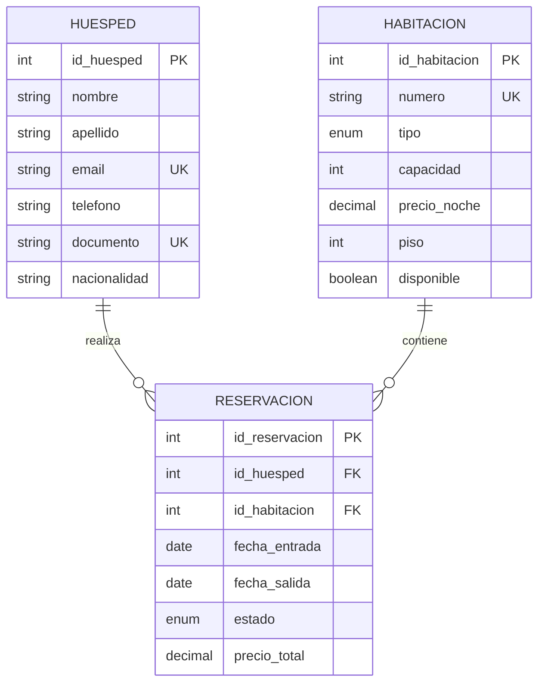

# 🏨 Better Homes Hotel - Sistema de Gestión de Reservaciones


Este proyecto representa una solución integral para la administración hotelera, conectando un frontend moderno en **React** con un ecosistema de datos robusto en **MySQL**. Diseñado bajo principios de **fluidez de información**, integridad relacional e inteligencia de negocio.

---

### 👥 Desarrollado por:
*   **LUIS ALBERTO BUELVAS COGOLLO** - Grupo 56647
*   **CAMILA ANDREA HERRERA GAMBOA** - Grupo 56648

**Curso:** ADMINISTRACION DE BASES DE DATOS  
**Docente:** SERGIO ALEXANDER MORA NOVOA  
**Programa:** Ingeniería de Sistemas  
**Institución:** Corporación Unificada Nacional de Educación Superior - CUN  
**Año:** 2026

---

## 📑 Índice de Contenido
1. [Diagrama Entidad-Relación (ERD)](#1-diagrama-entidad-relación-erd)
2. [Requerimientos del Sistema](#2-requerimientos-del-sistema)
3. [Modelo Relacional (Tablas)](#3-modelo-relacional-tablas)
4. [Código SQL de Creación (DDL)](#4-código-sql-de-creación-ddl)
5. [Catálogo de 10 Vistas SQL (Fluidez de Datos)](#5-catálogo-de-10-vistas-sql-fluidez-de-datos)
6. [Instalación y Configuración](#6-instalación-y-configuración)

---

## 1. Diagrama Entidad-Relación (ERD)

Visualización de las entidades principales y sus interacciones.



---

## 2. Requerimientos del Sistema

### 2.1 Requerimientos Funcionales (RF)
*   **RF-01: Gestión de Huéspedes:** Registro único por correo/documento.
*   **RF-02: Control de Inventario:** Gestión dinámica de disponibilidad de habitaciones.
*   **RF-03: Procesamiento de Reservas:** Vinculación temporal de activos.
*   **RF-04: Cálculo Financiero:** Estimación automática de costos totales.
*   **RF-05: Auditoría:** Trazabilidad de creaciones y actualizaciones.

### 2.2 Requerimientos No Funcionales (RNF)
*   **RNF-01: Integridad Referencial:** Restricciones estrictas de FK.
*   **RNF-02: Rendimiento:** Indexación en campos de búsqueda clave.
*   **RNF-03: Consistencia:** Motor InnoDB para transacciones ACID.
*   **RNF-04: Seguridad:** Credenciales cifradas y accesos restringidos.

---

## 3. Modelo Relacional (Tablas)

| Tabla | Propósito | Campos Clave |
| :--- | :--- | :--- |
| `huespedes` | Perfiles de clientes | `email`, `documento` |
| `habitaciones` | Inventario físico | `numero`, `tipo` |
| `reservaciones` | Historial y facturación | `id_huesped`, `id_habitacion` |

---

## 4. Código SQL de Creación (DDL)

```sql
-- Estructura Principal
CREATE DATABASE hotel_db;
USE hotel_db;

CREATE TABLE huespedes (
    id_huesped INT AUTO_INCREMENT PRIMARY KEY,
    nombre VARCHAR(100) NOT NULL,
    email VARCHAR(150) UNIQUE NOT NULL,
    documento VARCHAR(50) UNIQUE
);

CREATE TABLE habitaciones (
    id_habitacion INT AUTO_INCREMENT PRIMARY KEY,
    numero VARCHAR(10) UNIQUE NOT NULL,
    tipo ENUM('individual', 'doble', 'suite', 'penthouse'),
    precio_noche DECIMAL(10, 2) NOT NULL,
    disponible BOOLEAN DEFAULT TRUE
);

CREATE TABLE reservaciones (
    id_reservacion INT AUTO_INCREMENT PRIMARY KEY,
    id_huesped INT NOT NULL,
    id_habitacion INT NOT NULL,
    fecha_entrada DATE NOT NULL,
    fecha_salida DATE NOT NULL,
    precio_total DECIMAL(10, 2),
    FOREIGN KEY (id_huesped) REFERENCES huespedes(id_huesped),
    FOREIGN KEY (id_habitacion) REFERENCES habitaciones(id_habitacion)
);
```

---

## 5. Catálogo de 10 Vistas SQL (Fluidez de Datos)

Estas vistas permiten al negocio operar con rapidez sin lógica adicional en el backend:

1.  **`view_ocupacion_actual`**: Qué habitaciones están ocupadas HOY.
2.  **`view_disponibilidad_real`**: Habitaciones listas para ser vendidas.
3.  **`view_detalle_ingresos`**: Reporte financiero por reserva.
4.  **`view_clientes_vip`**: Top 10 de clientes con mayor consumo.
5.  **`view_llegadas_hoy`**: Planificación de recepciones (Check-ins).
6.  **`view_salidas_hoy`**: Planificación de limpieza (Check-outs).
7.  **`view_popularidad_habitaciones`**: Análisis de demanda por tipo.
8.  **`view_analisis_cancelaciones`**: Auditoría de pérdida de ingresos.
9.  **`view_ingresos_mensuales`**: Consolidado contable periódico.
10. **`view_estancias_largas`**: Identificación de clientes frecuentes.

---

## 6. Instalación y Configuración

### 💾 Base de Datos
Importa los datos de prueba (`seed_data.sql`) después de ejecutar el DDL.

### ⚙️ Backend (Servidor)
```bash
cd server
npm install
npm start
```

### 🎨 Frontend (Cliente)
```bash
cd hotelfinal
npm install
npm run dev
```

---
*Este proyecto es parte de la asignatura de Administración de Bases de Datos.*
